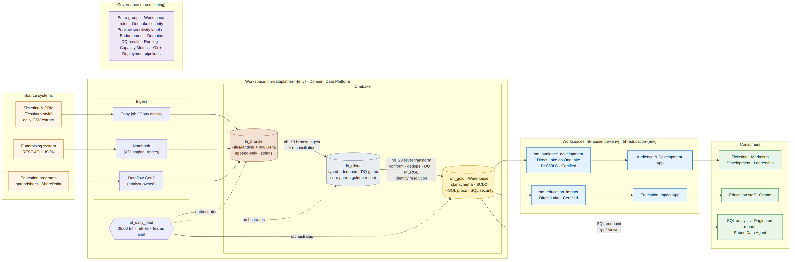
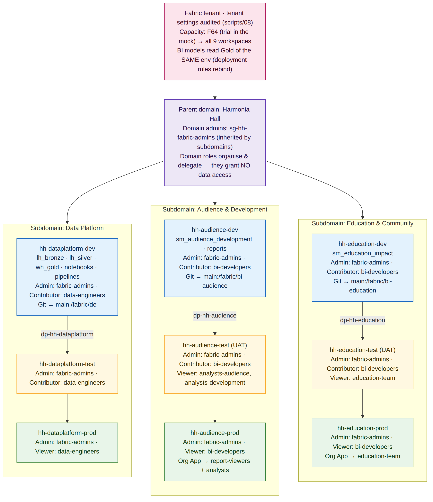
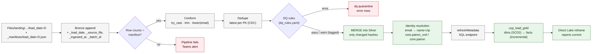
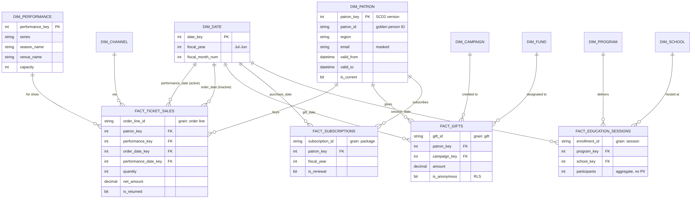
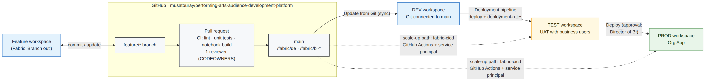
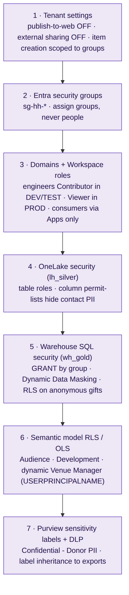

# Architecture

## 1. Platform overview

| Layer | Item | Contract (what the layer guarantees) | Owner |
|---|---|---|---|
| Landing | `lh_bronze/Files/landing/<source>/<entity>/load_date=D/` | Files exactly as received, plus a manifest with row counts | Data engineering |
| **Bronze** | `lh_bronze.<source>.<entity>` (Delta) | Append-only and immutable. All columns are strings. Lineage columns (`_load_date`, `_source_file`, `_ingested_at`, `_batch_id`). Reconciled to the manifest. | Data engineering |
| **Silver** | `lh_silver.<source>.<entity>`, `core.*`, `dq.*`, `audit.*` | Typed to the schema contract, trimmed, one row per business key (latest), DQ-gated (errors quarantined), identity-resolved patrons | Data engineering |
| **Gold** | `wh_gold.dim.*`, `fact.*`, `rpt.*`, `sec.*` | Star schema with a declared grain per fact, surrogate keys, unknown member -1, SCD2 patron, business definitions (sell-through, LYBUNT, renewal) | BI team |
| **Semantic** | `sm_audience_development`, `sm_education_impact` | Certified measures, RLS/OLS, Direct Lake | BI team |
| **Consumption** | Org Apps, `rpt.*` views, paginated reports, Data Agent | The only thing business users touch | BI team with business owners |

## 2. Tenant topology

See [ADR-004](adr/ADR-004-workspace-domain-topology.md). The design lives in [`config/tenant.yaml`](../config/tenant.yaml) and is applied by `scripts/00–05`.

## 3. Daily data flow and quality gates

## 4. Gold star schema

- **Role-playing date.** `fact_ticket_sales` has both `performance_date_key` (the active relationship: what season or show) and `order_date_key` (inactive, used for sales pacing).
- **SCD2 patron.** `patron_key` identifies a *version* and `patron_id` identifies a *person*. Always count people with `patron_id`.
- **Point-in-time lookups.** Each fact joins the patron version that was valid when the transaction happened.

## 5. CI/CD

## 6. Security layers

## 7. Naming conventions (the standard)

| Object | Pattern | Example |
|---|---|---|
| Workspace | `{org}-{family}-{env}` | `hh-audience-prod` |
| Deployment pipeline | `dp-{org}-{family}` | `dp-hh-dataplatform` |
| Lakehouse / Warehouse | `lh_{layer}` / `wh_{layer}` | `lh_silver`, `wh_gold` |
| Lakehouse schema | source system, or `core` / `dq` / `audit` | `lh_silver.fundraising.gifts` |
| Notebook | `nb_{nn}_{purpose}` (nn = run order) | `nb_20_silver_transform` |
| Pipeline | `pl_{cadence}_{purpose}` | `pl_daily_load` |
| Semantic model / report | `sm_{domain}` / `rp_{domain}_{topic}` | `sm_audience_development` |
| Warehouse objects | `dim.x`, `fact.x`, `rpt.vw_x`, `etl.usp_x`, `sec.fn_x` | `etl.usp_load_gold` |
| Entra group | `sg-{org}-{role}` | `sg-hh-analysts-development` |
| Lineage columns | leading underscore | `_load_date`, `_row_hash` |

## 8. Environment strategy

- **Identical item names in every environment.** Notebooks resolve lakehouses by name (`notebookutils.lakehouse.get("lh_silver")`) and Gold reads `[lh_silver].[schema].[table]`, so code is promoted **unchanged**.
- **Only DEV is Git-connected.** TEST and PROD are reached only through deployment pipelines.
- **Data doesn't move between environments.** Each environment ingests from its own source connection. In this demo, you upload landing files to each environment.

## 9. Microsoft Fabric deployment pattern

**Pattern 2: multiple workspaces, single capacity**, from Microsoft's [Fabric deployment patterns](https://learn.microsoft.com/en-us/azure/architecture/data-guide/technology-choices/fabric-deployment-patterns). The planned next step is **Pattern 3, per-environment capacities**.

### Why Pattern 2

| Pattern characteristic | This platform |
|---|---|
| Multiple workspaces | 9 workspaces: 3 families × dev/test/prod (`config/tenant.yaml`) |
| One shared capacity | All 9 on the Fabric Trial capacity (F64-equivalent) |
| Full DevOps (Git, deployment pipelines) | GitHub on the DEV workspaces, plus 3 deployment pipelines (ADR-005) |
| Separate workspaces for development, test and production | Dev › Test › Prod per family; builders are Viewers in PROD |
| Single region; no per-team chargeback or strict performance targets | Single-region nonprofit; one central BI budget |

### Which Pattern 2 sub-variants it combines

| Sub-variant (Microsoft) | How it's implemented here |
|---|---|
| **Hub and spoke** | Hub: `hh-dataplatform-*`, the central data plane owned by engineering. Spokes: `hh-audience-*` and `hh-education-*`, owned by each business area. |
| **Per-workload workspaces** | Ingestion and engineering (lakehouses, warehouse, notebooks, pipelines) are separated from consumption (semantic models, reports, apps). |
| **Data mesh via domains** | Parent domain *Harmonia Hall*, with subdomains Data Platform, Audience & Development, and Education & Community. |
| ~~Per-medallion-layer workspaces~~ | **Not used, on purpose.** Bronze, Silver and Gold share one workspace so `wh_gold` can read `lh_silver` through cross-database queries without shortcuts, and a four-person team has fewer workspaces to run (ADR-001, ADR-004). |

### Trade-offs we accept

| Dimension | Pattern 2 consequence | Mitigation |
|---|---|---|
| Performance | No workload isolation: a heavy DEV notebook can throttle PROD reports on the shared capacity | Heavy jobs off-hours (05:00 load, Sunday maintenance); incremental loads; Direct Lake instead of Import refreshes; watch the Capacity Metrics app (ADR-008) |
| Cost | Central billing, no per-team chargeback | Fine for one central BI budget; show usage by workspace from Capacity Metrics if leadership asks |
| Governance | Medium complexity | Config-as-code (`tenant.yaml`), validated in CI; domain admins are a group on the parent domain (inherited by subdomains) |

### When to move to Pattern 3

| Trigger | Pattern 3 sub-variant | Change |
|---|---|---|
| PROD dashboards need a performance guarantee, or DEV/TEST work throttles PROD | **Per-environment capacities** (the first step) | A second F-SKU for PROD. This is a small change: a per-environment `capacity_id` in `tenant.yaml` and a lookup in `scripts/02`, which already calls `assignToCapacity` when a workspace sits on the wrong capacity |
| A department wants to fund its own analytics | Per-business-unit capacities | A capacity per BI family |
| Data residency or a second region | Multi-geographic | Capacities per region, with shortcuts across them |

For which SKU to buy at each step, see the [capacity sizing reference](05-capacity-sizing.md).

Pattern 1 (a single workspace) was rejected because it rules out deployment pipelines and separation of duties. Pattern 4 (multiple tenants) applies only after an acquisition or with a legally separate subsidiary.

> **Say it in 30 seconds:** "It's Microsoft's Pattern 2, multiple workspaces on one capacity. It's a hub-and-spoke design: a central data-platform workspace and business-area BI workspaces, grouped by domains, with dev, test and prod environments. That fits a single-region nonprofit with a four-person team. The first move to Pattern 3 is a dedicated production capacity, once reports need a performance guarantee."
